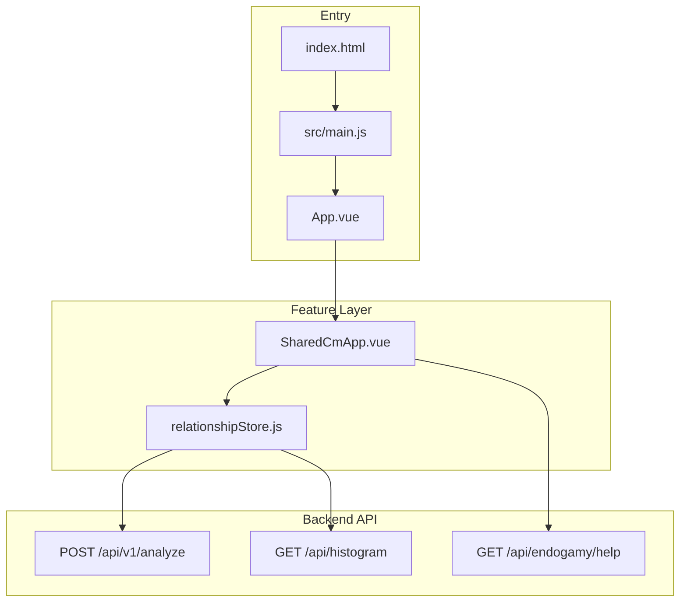
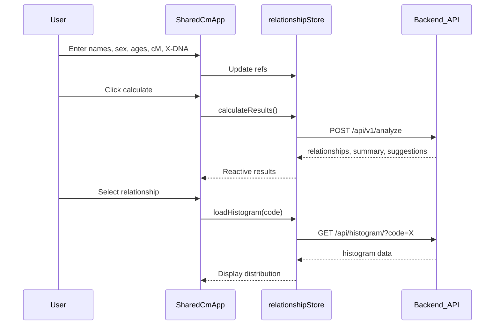

# Family Calculator Web — Codebase Analysis

## What This Project Is

**Family Calculator Web** is a genetic genealogy tool that helps users infer possible family relationships from DNA match data (shared centimorgans, X-chromosome inheritance, segment counts, endogamy). It targets Spanish-speaking users first, with English and Portuguese support.

- **Live domain hints:** `familycalc.app` (configured in `[vite.config.js](vite.config.js)`)
- **Repo size:** ~29 source files — small, flat codebase
- **Backend dependency:** Calculation logic runs server-side; the frontend is primarily a data-entry and results-display layer

---

## Tech Stack


| Layer         | Choice                                             |
| ------------- | -------------------------------------------------- |
| Framework     | Vue 3 (Composition API, `<script setup>`)          |
| Build         | Vite 4                                             |
| UI            | Naive UI + Ionicons5                               |
| State         | Pinia (single store)                               |
| Routing       | Vue Router 4 (registered but effectively bypassed) |
| i18n          | vue-i18n (ES default, EN, PT)                      |
| HTTP          | `fetch` in store (Axios module exists but unused)  |
| Visualization | D3 (tree chart built but not wired into UI)        |
| Language      | JavaScript only — no TypeScript                    |


**Scripts** (`[package.json](package.json)`): `dev`, `build`, `preview` — no test or lint scripts.

---

## Application Architecture




### Boot sequence

1. `[index.html](index.html)` loads `[src/main.js](src/main.js)`
2. `[src/main.js](src/main.js)` registers Vue Router, Naive UI, Pinia, and vue-i18n, then mounts `[App.vue](src/App.vue)`
3. `[App.vue](src/App.vue)` wraps Naive UI providers and renders `SharedCmApp` **directly** — no `<router-view>`

```1:17:src/main.js
import { createApp } from 'vue'
import App from './App.vue'
import router from '../router/router'
import naive from 'naive-ui'
import { createPinia } from 'pinia'
import i18n from './i18n'
import './style.css'

const app = createApp(App)

app.use(router)
app.use(naive)
app.use(createPinia())
app.use(i18n)

app.mount('#app')
```

```1:18:src/App.vue
<template>
  <n-config-provider>
    <n-message-provider>
      <n-layout>
        <n-layout-content>
          <n-space vertical size="large" style="padding: 20px">
            <SharedCmApp />
          </n-space>
        </n-layout-content>
      </n-layout>
    </n-message-provider>
  </n-config-provider>
</template>

<script setup>
import { NConfigProvider, NMessageProvider, NLayout, NLayoutContent, NSpace } from 'naive-ui'
import SharedCmApp from './components/SharedCmApp.vue'
</script>
```

---

## Core Domain Flow

### User input (Pinia store)

`[src/stores/relationshipStore.js](src/stores/relationshipStore.js)` holds all domain state:

- **People:** names, sex, ages for searcher and match
- **DNA:** shared cM, X match (yes/no/unknown), X cM, segment count/size, endogamy level
- **Results:** ranked relationships, histogram, narrative summary, investigation suggestions

### API calls

```5:6:src/stores/relationshipStore.js
const API_URL = import.meta.env.VITE_API_URL || window.location.origin
const API_VERSION = import.meta.env.VITE_API_VERSION || 'v1'
```


| Endpoint                          | Used by           | Purpose                                           |
| --------------------------------- | ----------------- | ------------------------------------------------- |
| `POST /api/{version}/analyze`     | Store             | Main relationship probability analysis            |
| `GET /api/histogram/?code={code}` | Store             | cM distribution for selected relationship         |
| `GET /api/endogamy/help`          | `SharedCmApp.vue` | Endogamy guidance (hardcoded to `localhost:8001`) |


Dev proxy in `[vite.config.js](vite.config.js)` forwards `/api` to `VITE_API_URL` (default `http://127.0.0.1:8000`).

### UI layer

`[src/components/SharedCmApp.vue](src/components/SharedCmApp.vue)` (~2,250 lines) is the entire product surface:

- Form for person/DNA inputs
- Advanced options panel
- Results: probability narrative, ranked relationships, investigation tips
- Sources modal (inline; separate `SourcesPage.vue` exists but is not routed)
- Locale switcher (ES/EN/PT)
- Large scoped CSS block (~1,000 lines)

---

## File Organization

```
family-calculator-web/
├── index.html              # HTML entry + Google Analytics
├── vite.config.js          # Dev server, API proxy, allowed hosts
├── router/router.js        # Active router (single route, unused in practice)
├── main.js                 # Legacy alternate entry (Bootstrap only)
└── src/
    ├── main.js             # App bootstrap
    ├── App.vue             # Root shell
    ├── components/
    │   ├── SharedCmApp.vue # Main feature (monolithic)
    │   ├── SourcesPage.vue # Sources popup (not routed)
    │   └── TreeChart.vue   # D3 tree (unused)
    ├── stores/
    │   └── relationshipStore.js
    ├── i18n/               # es.js, en.js, pt.js + index.js
    ├── data/               # Static JSON (not imported by frontend)
    ├── utils/buildGeneTree.js  # Tree builder (unused)
    ├── styles/             # CSS variables, base, components
    ├── api.js              # Axios wrapper (unused)
    └── router/index.js     # Alternate router (broken — references missing Home.vue)
```

---

## Internationalization

- Config: `[src/i18n/index.js](src/i18n/index.js)` — default locale `es`, persisted in `localStorage`
- Locale files: `[src/i18n/es.js](src/i18n/es.js)`, `[en.js](src/i18n/en.js)`, `[pt.js](src/i18n/pt.js)`
- Relationship labels are re-mapped on locale change inside `SharedCmApp.vue`
- Some computed summary text in the store is hardcoded in Spanish (e.g. `summaryText` computed property)

---

## Static Reference Data

These JSON files under `[src/data/](src/data/)` document genetic probability sources but are **not imported** by frontend code — likely backend reference or documentation artifacts:

- `relationships.json` — cM ranges per relationship code (Shared cM Project v4)
- `probabilidades.json` — probability curves by cM
- `xInheritance.json` — X-chromosome inheritance patterns
- `distribuciones.json` — histogram distributions

---

## Environment & Deployment

**Documented env vars** (`[.env.example](.env.example)`):


| Variable                      | Wired up?                             |
| ----------------------------- | ------------------------------------- |
| `VITE_API_URL`                | Yes — store, vite proxy               |
| `VITE_API_VERSION`            | Yes — store                           |
| `VITE_APP_TITLE`              | No — title hardcoded in `index.html`  |
| `VITE_APP_DESCRIPTION`        | No                                    |
| `VITE_ENABLE_ANALYTICS`       | No — GA always loaded in `index.html` |
| `VITE_ENABLE_ERROR_REPORTING` | No                                    |
| `VITE_DEV_SERVER_PORT`        | No — port hardcoded to 3000           |
| `VITE_ENVIRONMENT`            | No                                    |


**Deployment:** No Dockerfile, CI workflow, or hosting config in-repo. Production hints exist only as `allowedHosts` in Vite config (`familycalc.app`, AWS IP `18.189.205.126`). Build output is standard Vite `dist/`.

---

## Strengths

- **Clear separation of calculation from UI** — probability logic delegated to backend API
- **Single Pinia store** — easy to trace all domain state and API interactions
- **Multi-language support** — ES/EN/PT with locale persistence
- **Small codebase** — low onboarding overhead; entire app understandable in one session
- **Modern Vue 3 stack** — Composition API, Vite, Naive UI

---

## Technical Debt & Gaps

### Architecture

1. **Monolithic component** — `SharedCmApp.vue` mixes form, results, modals, i18n mapping, and ~1,000 lines of CSS; hardest file to maintain or test
2. **Router registered but bypassed** — Vue Router is mounted but `App.vue` embeds the component directly; `SourcesPage` and `/sources` route are unreachable
3. **Duplicate entry points** — root `[main.js](main.js)` vs `[src/main.js](src/main.js)`
4. **Duplicate routers** — `[router/router.js](router/router.js)` (active) vs `[src/router/index.js](src/router/index.js)` (broken, unused)

### Dead code & unused dependencies


| Item                                         | Status                        |
| -------------------------------------------- | ----------------------------- |
| `src/api.js` (Axios)                         | Not imported                  |
| `TreeChart.vue` + `buildGeneTree.js`         | Not imported                  |
| `src/data/*.json`                            | Not imported                  |
| `react`, `react-dom`, `@vitejs/plugin-react` | In package.json, unused       |
| `bootstrap`                                  | Only in unused root `main.js` |
| `axios`                                      | Only in unused `src/api.js`   |


### Quality & ops

- **No tests** — no Vitest/Jest/Cypress; no test files
- **No CI/CD** — no GitHub Actions; builds/deploys appear manual
- **No linting/formatting** — no ESLint, Prettier, or TypeScript
- **No README** — setup, env vars, and deployment undocumented
- **Hardcoded URLs** — endogamy help endpoint uses `localhost:8001`; summary text in store is Spanish-only
- **Env var drift** — `.env.example` documents flags that the app never reads

---

## Data Flow Summary




---

## Suggested Follow-Up Areas (if you want to act on this analysis)

These are optional next steps — not part of this analysis itself:

1. **Split `SharedCmApp.vue`** into form, results, and modal sub-components
2. **Remove dead code** — unused router, api.js, TreeChart, root main.js, React deps
3. **Wire or remove env vars** — analytics flag, app title, dev port
4. **Add minimal test + CI scaffold** — Vitest for store logic, GitHub Actions for build
5. **Fix i18n gaps** — move hardcoded Spanish in store computed properties into locale files
6. **Add README** — local dev setup, env vars, API dependency, deployment notes

